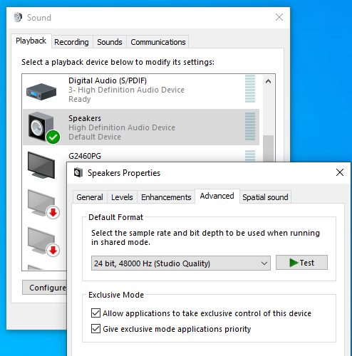
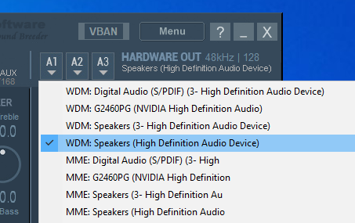
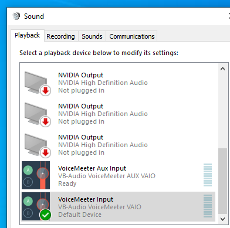
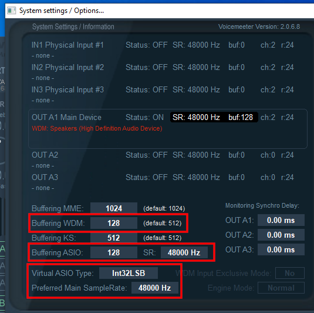
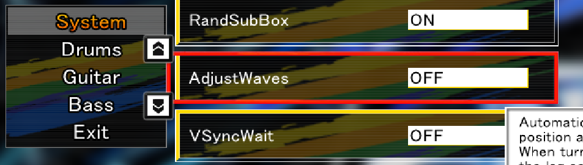
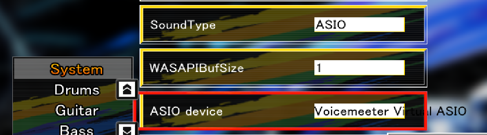
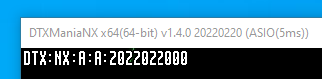
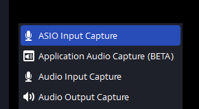
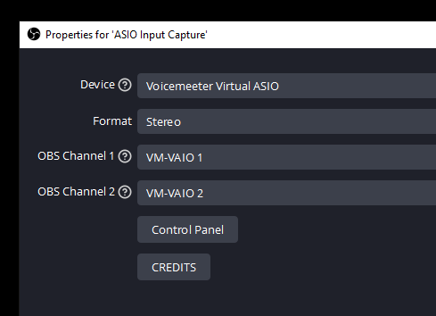

# Use ASIO in DTXManiaNX while recording to OBS Studio
This guide allows you to setup DTXManiaNX to use ASIO while still being able to record audio to OBS, all without the use of any extra hardware!

## Setup VoiceMeeter Banana

First step is to determine what output device you would like DTXManiaNX to ouput to and its sample rate. I use my `Speakers (High Definition Audio Device)` which has a sample rate of 48000 Hz (note this number down you will need it later).

Next is to download and install [VoiceMeeter Banana](https://vb-audio.com/Voicemeeter/banana.htm) which you will use as your ASIO driver. Once installed you need to set your hardware output device. Go to the `HARDWARE OUT` section (top right) and click `A1`, then select your output device found earlier ensuring you select the WDM version. For me its `WDM: Speakers (High Definition Audio Device)`.

Now that your output device is selected VoiceMeeter will take exclusive control of that device. In order for you to hear audio from your system and DTXManiaNX you will need to tell Windows to send all playback audio to VoiceMeeter which will then forward it to your output device. To do this open your Windows Sound devices again and select `VoiceMeeter Input` as your default playback device.

After this has been completed I would recommend restarting VoiceMeeter and playing some audio (like a YouTube video ) on your system to ensure it is working correctly.

If all is well you can now setup the ASIO driver in VoiceMeeter which will be used by DTXManiaNX. To do this navigate to `Menu` (top right) and select `System Settings / Options`. Here you will configure your sample rate based on the sample rate of your output device and the buffer size:

- `Buffering WDM: 128` (this will give you a 5 ms delay, if you hear audio artifacts increase this value, if you want less delay decrese this value)
- `Buffering ASIO: 128 SR: 48000 Hz` (ASIO buffer size should match whatever is set for `Buffering WDM:`, sample rate should match that of your output audio device)
- `Virtual ASIO Type: Int32LSB` (if audio is heavily distorted try switching this to `Float32LSB`)
- `Prefered Main SampleRate: 48000 Hz` (should match sample rate of your audio output device)

## Configure DTXManiaNX

Now you will need to configure DTXManiaNX to use the VoiceMeeter ASIO driver. Ensure VoiceMeeter is running then start DTXManiaNX and go to `Config` then `System`.

Turn these off as per [Furukon's recommendation](https://youtu.be/lMjwAq-vQwU?t=130):
- `AdjustWaves: OFF`
- `VSyncWait: OFF`

And setup DTXManiaNX to use the ASIO driver:
- `SoundType: ASIO`
- `ASIO device: Voicemeeter Virtual ASIO`

Exit out of DTXManiaNX gracefully to save settings and restart to ensure its using the ASIO driver. You can confirm this by looking at the title of the DTXManiaNX window (Alt + Enter to switch to windowed mode).

You should now be able to hear the audio from DTXManiaNX while using the ASIO driver. If you can't I recommend closing DTXManiaNX, restarting VoiceMeeter, and then restarting DTXManiaNX. Note that VoiceMeeter has to be running before you start DTXManiaNX for it to work (there is an option to run VoiceMeeter on startup which I use).

## Setup OBS Studio

To setup OBS to capture DTXManiaNX's ASIO audio you will need:
- [OBS Studio](https://obsproject.com/)
- [OBS ASIO Plugin](https://github.com/Andersama/obs-asio)

Once both are installed open OBS and add a new `ASIO Input Capture` source (this option is added by the OBS ASIO plugin).

Configure the capture properties as follows:
- `Device: Voicemeeter Virtual ASIO`
- `Format: Stereo`
- `OBS Channel 1: VM-VAIO 1`
- `OBS Channel 2: VM-VAIO 2`

And that's it you should now see your DTXManiaNX audio show up in OBS while using the ASIO driver, enjoy!

## Other Notes
I have tried using other solutions such as [JACK Audio Connection Kit](https://jackaudio.org/faq/jack_on_windows.html) and [ODeus ASIO Link Pro](https://give.academy/downloads/2018/03/03/ODeusASIOLinkPro/) to no avail. I was only able to get this working with [VoiceMeeter Banana](https://vb-audio.com/Voicemeeter/banana.htm).
